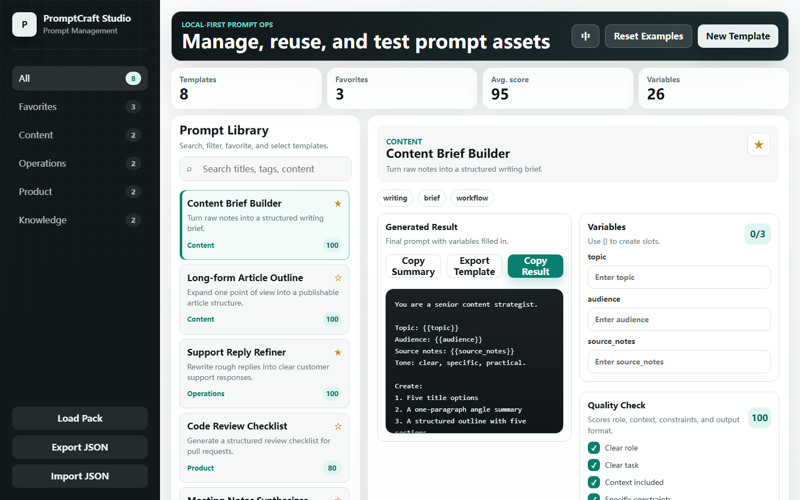

# PromptCraft Studio

PromptCraft Studio is a local-first prompt management platform for creators, operators, and AI product teams. It helps you save prompt templates, mark favorites, fill variables, copy final prompts, import and export libraries, and score prompt quality from a single browser screen.

[中文说明](README.zh-CN.md)

[](https://vercel.com/new/clone?repository-url=https://github.com/kevin-luo/promptcraft)
[](https://app.netlify.com/start/deploy?repository=https://github.com/kevin-luo/promptcraft)

## Why It Exists

Prompts are becoming reusable product assets. Teams need a lightweight place to keep them organized, testable, and easy to share. PromptCraft Studio starts as a zero-dependency static app, so anyone can open, demo, deploy, and modify it quickly.

## Features

- Prompt template library with categories and tags
- Chinese and English interface switch with separate example libraries
- Favorite prompts for fast access
- Search across titles, tags, descriptions, and template content
- Variable slots using `{{variable}}`
- One-click rendered prompt copy
- Raw template copy, single-template export, and template summary copy
- Version history for edited prompts
- Prompt quality checklist and score
- JSON import and export for backup or sharing
- Built-in Chinese and English examples for content writing, support, product work, code review, RAG, AI assistants, and meeting notes
- Starter prompt packs in `prompts/starter-pack.zh-CN.json` and `prompts/starter-pack.en.json`
- Local-first storage through `localStorage`
- One-command local demo with `node server.js`
- Static deployment support for Vercel, Netlify, Cloudflare Pages, GitHub Pages, and Docker

## Preview



## Quick Start

```bash
node server.js
```

Open the English interface:

```text
http://localhost:4173/?lang=en
```

Run the validation script:

```bash
npm test
```

## One-click Deployment

PromptCraft Studio is a static app. Use any static host.

### Vercel

[Deploy with Vercel](https://vercel.com/new/clone?repository-url=https://github.com/kevin-luo/promptcraft)

### Netlify

[Deploy to Netlify](https://app.netlify.com/start/deploy?repository=https://github.com/kevin-luo/promptcraft)

### GitHub Pages

Use `Settings -> Pages`, then choose `Deploy from a branch` and select `main / root`. The repository also includes a manual Pages workflow for teams that prefer GitHub Actions.

### Docker

```bash
docker build -t promptcraft-studio .
docker run --rm -p 4173:4173 promptcraft-studio
```

## Product Roadmap

- Prompt version history
- Team workspace and shared libraries
- Prompt test cases and output comparison
- Model cost and latency logging
- Prompt marketplace-style public gallery
- Optional backend adapters for SQLite, Supabase, and PostgreSQL
- Browser extension for saving prompts from ChatGPT, Claude, Gemini, and other tools

## Project Structure

```text
.
├── index.html
├── assets/
│   ├── app.js
│   └── styles.css
├── docs/
├── server.js
├── Dockerfile
├── vercel.json
└── netlify.toml
```

## Contributing

Contributions are welcome. See [CONTRIBUTING.md](CONTRIBUTING.md) for setup, coding style, and contribution scope.

## License

MIT
