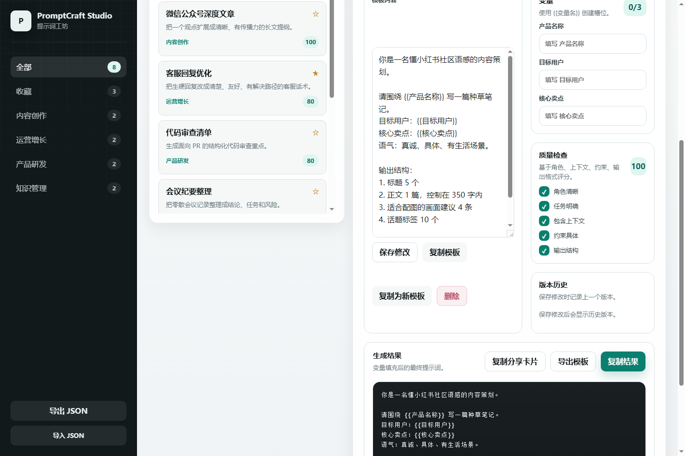

# PromptCraft Studio / 提示词工坊

PromptCraft Studio 是一个本地优先的提示词管理平台，面向创作者、运营人员和 AI 产品团队。它可以管理提示词模板、收藏常用模板、填写变量、一键复制最终提示词、导入导出模板库，并用质量清单给提示词打分。

[English README](README.md)

[](https://vercel.com/new/clone?repository-url=https://github.com/kevin-luo/promptcraft)
[](https://app.netlify.com/start/deploy?repository=https://github.com/kevin-luo/promptcraft)

## 项目定位

提示词正在变成一种可复用的生产资料。很多人已经积累了大量提示词，却散落在聊天记录、备忘录、文档和表格里。PromptCraft Studio 给这些提示词一个轻量、清晰、可部署的工作台。

## 核心功能

- 提示词模板库，支持分类和标签
- 收藏常用提示词
- 搜索标题、标签、描述和模板正文
- 使用 `{{变量名}}` 创建变量槽位
- 填写变量后一键复制最终提示词
- 复制原始模板、导出单个模板、复制分享卡片
- 保存修改时生成版本历史
- 提示词质量检查与评分
- JSON 导入导出，方便备份和分享
- 内置小红书、公众号、客服、产品文案、代码审查、RAG、AI 助手、会议纪要模板
- 提供 `prompts/starter-pack.zh-CN.json` 示例模板包
- 使用浏览器本地存储，适合快速演示
- 支持 Vercel、Netlify、Cloudflare Pages、GitHub Pages、Docker 等静态部署方式

## 界面预览



## 快速启动

```bash
node server.js
```

打开：

```text
http://localhost:4173
```

运行项目检查：

```bash
npm test
```

## 一键部署思路

这个项目是零依赖静态应用，部署时只需要托管整个目录。

### Vercel

[Deploy with Vercel](https://vercel.com/new/clone?repository-url=https://github.com/kevin-luo/promptcraft)

### Netlify

[Deploy to Netlify](https://app.netlify.com/start/deploy?repository=https://github.com/kevin-luo/promptcraft)

### GitHub Pages

项目内置 Pages 工作流。仓库 Pages 来源选择 GitHub Actions，推送到 `main` 后自动发布。

### Docker

```bash
docker build -t promptcraft-studio .
docker run --rm -p 4173:4173 promptcraft-studio
```

## 适合推广的卖点

- 把散落的提示词变成一个可管理的资产库
- 中文创作者开箱即用
- 模板变量化后可以稳定复用
- 收藏、搜索、复制流程很适合日常高频使用
- 本地存储，演示简单，部署轻量

## 后续路线图

- 团队共享模板库
- 提示词测试集与输出对比
- 模型成本和响应时间记录
- 公开模板广场
- SQLite、Supabase、PostgreSQL 后端适配
- 浏览器扩展，支持从常见 AI 产品保存提示词

## 目录结构

```text
.
├── index.html
├── assets/
│   ├── app.js
│   └── styles.css
├── docs/
├── server.js
├── Dockerfile
├── vercel.json
└── netlify.toml
```

## 许可证

MIT
